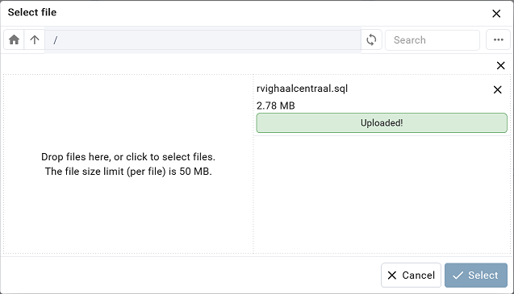

# Opzetten/Opstarten containerized BRP Bevragen end-to-end test omgeving

Start de containers met behulp van de volgende statement

```
docker-compose -f docker-compose-e2e.yml up -d
```

Stop de containers met behulp van de volgende statement

```
docker-compose -f docker-compose-e2e.yml down
```

## Beheren van de BRP bevragen test database

Dit kan worden gedaan met behulp van de pgAdmin tool. Deze wordt opgestart door in een browser naar de volgende url te navigeren

```
http://localhost:5433
```

login met Email Address / Username: admin@haalcentraal.nl en Password: root

### Connectie maken met de database

rechter muis klik op Servers. Selecteer Register > Server...


In de Register-Server dialog box, vul de volgende velden in


password: root

klik op de **Save** button

De volgende stappen zijn alleen nodig als de BRP database nog niet is ge-restored

### Aanmaken Login/Group Role 'haalcentraal'

rechter muis klik op Login/Group Roles. Selecteer Create > Login/Group Role...


In de Create - Login/Group Role dialog box, vul de Name veld en selecteer alle privileges


klik op de **Save** button

### Aanmaken 'rvig_haalcentraal_testdata' database

rechter muis klik op Databases. Selecteer Create > Database...


In de Create - Database dialog box, vul de volgende velden in


klik op de **Save** button

### Restore 'rvig_haalcentraal_testdata' database

rechter muis klik op rvig_haalcentraal_testdata. Selecteer Restore...


In de Restore (Database: rvig_haalcentraal_testdata) dialog box, klik op de map icoon in de Filename text box


In de Select file dialog box, klik op de ... knop en selecteer Upload


Drag en Drop de rvighaalcentraal.sql bestand in de Select file dialog box



klik op de **Cancel** button

In de Restore (Database: rvig_haalcentraal_testdata) dialog box, klik opnieuw op de map icoon in de Filename text box.

In de Select file dialog box, selecteer de rvighaalcentraal.sql bestand en klik op de **Select** button


In de Restore (Database: rvig_haalcentraal_testdata) dialog box, klik op de **Restore** button

Als de restore is geslaagd, wordt de volgende dialog box getoond


Klik op **X** om de dialog box te sluiten

### Update de 'landelijke tabellen' in de 'rvig_haalcentraal_testdata' database

Voer de volgende statement uit: `npm run db:update-waarde-tabellen`

### Update lo3_titel_predikaat tabel script

Voer de volgende regels uit:

```
ALTER TABLE public.lo3_titel_predikaat RENAME TO lo3_titel_predicaat;
ALTER TABLE public.lo3_titel_predicaat RENAME COLUMN titel_predikaat TO titel_predicaat;
ALTER TABLE public.lo3_titel_predicaat RENAME COLUMN titel_predikaat_oms TO titel_predicaat_oms;
ALTER TABLE public.lo3_titel_predicaat RENAME COLUMN titel_predikaat_soort TO titel_predicaat_soort;

UPDATE public.lo3_titel_predicaat
SET titel_predicaat_soort = 'predicaat'
WHERE titel_predicaat_soort = 'predikaat';

ALTER TABLE public.lo3_pl_persoon RENAME COLUMN titel_predikaat TO titel_predicaat;
```

