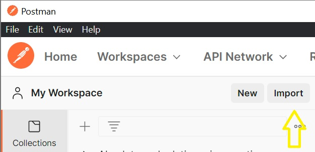

# Getting Started

De '{{site.apiname}}' Web API is gespecificeerd in OpenAPI specifications (OAS).

Wil je de API gebruiken? Dit kun je doen:

1. Bekijk de [functionaliteit en specificaties](#functionaliteit-en-specificaties)
2. [Implementeer de API Client](#implementeer-de-api-client)
3. [Probeer en test de API](#probeer-en-test-de-api)

## Functionaliteit en specificaties

Je kunt een visuele representatie van de specificatie genereren met [Redoc]({{ site.baseurl }}/redoc).

De (resolved) OAS3 kun je hier downloaden: [openapi.yaml](https://github.com/VNG-Realisatie{{ site.baseurl }}/blob/v2.0.0beta1/specificatie/genereervariant/openapi.yaml).

De [functionele documentatie](./features-v2-beta) vind je in [features](./features-v2-beta).

## Implementeer de API client
Client code kun je genereren met de "[genereervariant](https://github.com/VNG-Realisatie{{ site.baseurl }}/blob/v2.0.0beta1/specificatie/genereervariant/openapi.yaml){:target="_blank" rel="noopener"}" van de API-specificaties en een code generator. Een overzicht met codegeneratoren kun je vinden op [OpenAPI.Tools](https://openapi.tools/#sdk){:target="_blank" rel="noopener"}.

Deze repo bevat scripts waarmee je met [OpenAPI Generator](https://openapi-generator.tech/){:target="_blank" rel="noopener"} client code kunt genereren in JAVA, .NET (Full Framework & Core) en Python. De makkelijkste manier om de code generatie scripts te gebruiken, is door deze repo te clonen. Na het clonen kun je met `npm install` de benodigde packages installeren en kun je met npm run <script naam> één van de volgende scripts uitvoeren:
- oas:generate-java-client (voor JAVA client code)
- oas:generate-netcore-client (voor .NET Core client code)
- oas:generate-net-client (voor .NET Full Framework client code)
- oas:generate-python-client (voor Python client code)

Een lijst met andere ondersteunde generator opties kun je vinden in de [Generators List](https://openapi-generator.tech/docs/generators){:target="_blank" rel="noopener"} van OpenAPI Generator.

Note. De prerequisite van OpenAPI Generator is JAVA. Je moet een JAVA runtime installeren voordat je OpenAPI Generator kunt gebruiken
  
## Probeer en test de API

Wil je de '{{site.apiname}}' Web API proberen en testen? Kijk op: `https://www.haalcentraal.nl/haalcentraal/api/brp`

Om de web api te gebruiken heb je een apikey nodig. Deze voeg je aan een request toe als header "X-API-KEY". Een API-key vraag je aan bij de product owner [c.dingemanse@comites.nl](mailto:c.dingemanse@comites.nl), of wordt ter plekke aan jou uitgereikt op de API Lab.

__De Haal Centraal probeeromgeving gebruikt GBA-V op basis van de gemeentelijke autorisatie "Algemene gemeentetaken" voor buitengemeentelijke personen. Dit betekent dat de GBA-V niet alle gegevens teruggeeft die in de response zijn gedefinieerd. In de [API mapping](https://github.com/VNG-Realisatie{{ site.baseurl }}/blob/master/docs/BRP-LO%20GBA%20mapping.xlsx?raw=true){:target="_blank" rel="noopener"} kun je zien welke gegevens wel of niet onder deze autorisatie vallen.__

__Je kan de Haal Centraal probeeromgeving niet gebruiken vanuit de browser, dus ook niet vanuit de browserversie van Postman. Gebruik dus de desktopversie van een testtool (zoals Postman) om berichten te sturen.__

### Importeer de specificaties in Postman

De werking van de '{{site.apiname}}' Web API is het makkelijkst te testen met behulp van [Postman](https://www.getpostman.com/){:target="_blank" rel="noopener"}. We hebben al een [Postman collection](https://raw.githubusercontent.com/VNG-Realisatie{{ site.baseurl }}/master/test/BRP-Bevragen-v2-postman-collection.json){:target="_blank" rel="noopener"} voor je klaargezet. Deze kun je importeren in Postman.

In Postman kun je de Postman collection importeren en visueel de {{site.apiname}} Personen endpoint aanroepen. Volg deze stappen om de Postman collection te importeren:

1.Klik op de Import button om de Import dialog box te openen

  

2.Selecteer de 'Link' tab, plak de volgende url in de 'Enter a URL' textbox en klik op de Continue button

  

``` url
https://raw.githubusercontent.com/VNG-Realisatie{{ site.baseurl }}/master/test/BRP-Bevragen-v2-postman-collection.json
```

3.Klik op de Import button om de Postman collectie te importeren

  

4.Import overzicht

  

### Configureer de url en api key

1. Klik op "Bevragen Personen v2" om de globale configuratie en documentatie scherm te openen.

2. In de "Auth" tabblad, kies Type "API Key"
3. Vul in Key: "x-api-key", Value: de API key die je van Cathy hebt ontvangen, Add to: "Header"
4. Selecteer tabblad "Variables"
5. Vul bij baseUrl INITIAL VALUE en bij CURRENT VALUE: `https://www.haalcentraal.nl/haalcentraal/api/brp`

### Raadpleeg een Natuurlijk Persoon

Selecteer hiervoor de POST Raadpleeg met burgerservicenummer request.  
  
Selecteer de "Body" tabblad in het invoerscherm voor de request. Vul één of meerdere burgerservicenummers in in het burgerservicenummer veld en één of meerdere veld paden in het fields veld. Zie onderaan de Getting started voor mogelijke burgerservicenummers.

Klik op de Send button om de request naar de endpoint te sturen. De Web API reageert dan met een response:  


### Testpersonen

Deze tabel bevat fictieve burgerservicenummers van testpersonen voor specifieke situaties waarmee de 'Bevraging Persoon' Web API kan worden getest.

burgerservicenummer | situatie
---------------- | :-------  
999993847 | ouders, partner, kinderen, BAG-adres, verblijfplaats in onderzoek
999992077 | overleden
999993483 | geëmigreerd, verblijf buitenland, geheimhouding, uitgebreide verblijfplaatshistorie
999990482 | niet-BAG adres
000009921 | locatiebeschrijving
999993653 | niet-Nederlandse nationaliteit, ouders niet ingeschreven
999995017 | actuele en historische verblijfstitel
999990408 | gezag minderjarige
999994669 | verblijfplaatshistorie met verblijf buitenland en locatiebeschrijving en adrescorrectie
999992806 | uitgebreide verblijfstitelhistorie
999993926 | actuele en meerdere ex-partners
999991905 | twee beëindigde relaties
999993550 | partner niet ingeschreven
999990421 | meerdere kinderen, wel en niet-ingeschreven

De API gebruikt de GBA-V proefomgeving. Alle testpersonen die daarin voorkomen kun je ook in de API gebruiken. De volledige set testpersonen kan worden gedownload bij de [RvIG](https://www.rvig.nl/documenten/richtlijnen/2018/09/20/testdataset-persoonslijsten-proefomgevingen-gba-v){:target="_blank"}.
Een vertaling van GBA-V (LO GBA) attributen naar BRP API properties staat beschreven in de [BRP-LO GBA mapping](https://github.com/VNG-Realisatie{{ site.baseurl }}/blob/master/docs/BRP-LO%20GBA%20mapping.xlsx?raw=true){:target="_blank" rel="noopener"}.
