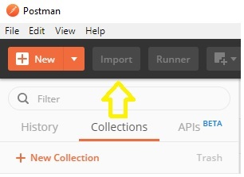

# Getting Started

De 'Bevraging Ingeschreven Persoon' Web API is gespecificeerd met behulp van de OpenAPI specifications (OAS).

Een visuele representatie van de specificatie kan worden gegenereerd met [Swagger UI](https://petstore.swagger.io/?url=https://raw.githubusercontent.com/VNG-Realisatie/Bevragingen-ingeschreven-personen/master/api-specificatie/Bevraging-Ingeschreven-Persoon/resolved/openapi.yaml).

De OAS specificatie van de 'Bevraging Ingeschreven Persoon' Web API is te downloaden van de [Haal-Centraal-BRP-bevragen github repository](https://raw.githubusercontent.com/VNG-Realisatie/Haal-Centraal-BRP-bevragen/master/api-specificatie/Bevraging-Ingeschreven-Persoon/resolved/openapi.yaml).

De [functionele documentatie](https://github.com/VNG-Realisatie/Bevragingen-ingeschreven-personen/tree/master/features) van de 'Bevraging Ingeschreven Persoon' Web API is ook te vinden in de github repository.

De API lab versie van de 'Bevraging Ingeschreven Persoon' Web API is te benaderen via de volgende url: https://www.haalcentraal.nl/haalcentraal/api/brp

Om de web api te kunnen bevragen is een apikey nodig. Een apikey kan worden aangevraagd bij ...

De test cases die door de API lab versie van de 'Bevraging Ingeschreven Persoon' Web API worden ondersteund zijn te downloaden via https://tinyurl.com/RVIGTestCases

De werking van de 'Bevraging Ingeschreven Persoon' Web API is het makkelijkst te testen met behulp van [Postman](https://www.getpostman.com/).

In Postman kan de 'Bevraging Ingeschreven Persoon' OpenAPI specificatie worden geïmporteerd en kan vervolgens visueel de verschillende endpoints worden aangeroepen. Volg onderstaande stappen om de OpenAPI specificatie bestand te importeren:

  
1.Klik op de Import button om de Import dialog box te openen

  
2.Selecteer 'Import From Link' tab, plak de volgende url in de 'Enter a URL and press Import' textbox en klik op de Import button

``` url
https://raw.githubusercontent.com/VNG-Realisatie/Haal-Centraal-BRP-bevragen/master/api-specificatie/Bevraging-Ingeschreven-Persoon/resolved/openapi.yaml
```

  
3.Klik op de Next button om een Postman collectie te genereren uit OpenAPI specificatie bestand

  
4.Import overzicht

## Raadplegen van een Ingeschreven Natuurlijk Persoon

Selecteer hiervoor de /GET ingeschreven Natuurlijk Persoon request.  
  
In het rechterscherm wordt een invoerscherm voor de request getoond. Uncheck voor de volgende voorbeeld aanroep de expand en fields Query Params en vul in de burgerservicenummer Path Variabele een bsn uit het 20190524_Testset+persoonslijsten+proefomgeving+GBA-V.ods bestand dat is te downloaden via https://tinyurl.com/RVIGTestCases.

Selecteer de Headers tab en voeg de x-api-key header toe met de aan u gemailde apikey.
  

Vervang de {{baseUrl}} in de url met https://www.haalcentraal.nl/haalcentraal/api/brp en klik de Send button om de request naar de endpoint te sturen. De 'Bevraging Ingeschreven Persoon' Web API zal reageren met onderstaand response:  


In de response is te zien dat de ouders van de opgevraagde persoon ook in de registratie staan. Deze kunnen worden geraadpleegd met de urls onder de _links/ouders element. De gegevens van de ouders kunnen ook direct worden opgehaald tijdens de bevraging van een persoon. Dit gebeurt middels de expand Query Parameter. Met behulp van de expand Query Parameter kan behalve de gegevens van de ouders, (indien aanwezig) ook de gegevens van kind(-eren) en partner(s) worden opgehaald. De gegevens van de ouders, partners en/of kinderen zijn dan te vinden onder de _embedded element:

