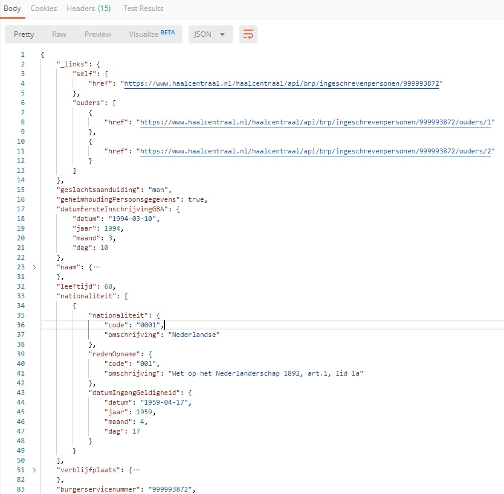

# Getting Started

De 'Bevraging Ingeschreven Persoon' Web API is gespecificeerd met behulp van de OpenAPI specifications (OAS).

Een visuele representatie van de specificatie kan worden gegenereerd met [Swagger UI](https://petstore.swagger.io/?url=https://raw.githubusercontent.com/VNG-Realisatie/Bevragingen-ingeschreven-personen/master/api-specificatie/Bevraging-Ingeschreven-Persoon/resolved/openapi.yaml).

De OAS specificatie van de 'Bevraging Ingeschreven Persoon' Web API is te downloaden van de [Haal-Centraal-BRP-bevragen github repository](https://raw.githubusercontent.com/VNG-Realisatie/Haal-Centraal-BRP-bevragen/master/api-specificatie/Bevraging-Ingeschreven-Persoon/resolved/openapi.yaml).

De [functionele documentatie](https://github.com/VNG-Realisatie/Bevragingen-ingeschreven-personen/tree/master/features) van de 'Bevraging Ingeschreven Persoon' Web API is ook te vinden in de github repository.

De 'Bevraging Ingeschreven Persoon' Web API is te benaderen via de volgende url: https://www.haalcentraal.nl/haalcentraal/api/brp

Om de web api te kunnen bevragen is een apikey nodig. Deelnemers aan een API lab krijgen de apikey toegestuurd (per e-mail) wanneer ze zich hebben aangemeld.

De werking van de 'Bevraging Ingeschreven Persoon' Web API is het makkelijkst te testen met behulp van [Postman](https://www.getpostman.com/).

In Postman kan de 'Bevraging Ingeschreven Persoon' OpenAPI specificatie worden geïmporteerd en kan vervolgens visueel de verschillende endpoints worden aangeroepen. Volg onderstaande stappen om de OpenAPI specificatie bestand te importeren:

  
1.Klik op de Import button om de Import dialog box te openen

  
2.Selecteer 'Import From Link' tab, plak de volgende url in de 'Enter a URL and press Import' textbox en klik op de Import button

``` url
https://raw.githubusercontent.com/VNG-Realisatie/Haal-Centraal-BRP-bevragen/master/api-specificatie/Bevraging-Ingeschreven-Persoon/resolved/openapi.yaml
```

  
3.Klik op de Next button om een Postman collectie te genereren uit OpenAPI specificatie bestand

  
4.Import overzicht

## Raadplegen van een Ingeschreven Natuurlijk Persoon

Selecteer hiervoor de /GET ingeschreven Natuurlijk Persoon request.  
  
In het rechterscherm wordt een invoerscherm voor de request getoond. Uncheck voor de volgende voorbeeld aanroep de expand en fields Query Params en vul in de burgerservicenummer Path Variabele een bsn uit het 20190524_Testset+persoonslijsten+proefomgeving+GBA-V.ods bestand dat is te downloaden via https://tinyurl.com/RVIGTestCases.

Selecteer de Headers tab en voeg de x-api-key header toe met uw apikey.
  

Vervang de {{baseUrl}} in de url met https://www.haalcentraal.nl/haalcentraal/api/brp en klik de Send button om de request naar de endpoint te sturen. De 'Bevraging Ingeschreven Persoon' Web API zal reageren met onderstaand response:  


De 'Bevraging Ingeschreven Persoon' Web API maakt gebruik van de HAL (Hypertext Application Language) standaard om bij een resource links op te nemen naar gerelateerde resources en/of om bij een resource gerelateerde resources op te nemen (embedden).  
In de response hierboven is voor de bevraagde persoon te zien dat het _links/ouders element links bevat naar de ouders van de bevraagde persoon.

De gegevens van ouders kunnen ook worden ge-embed tijdens de bevraging van een persoon. Dit gebeurt met behulp van de `expand` Query Parameter. Behalve de ouders kunnen (indien aanwezig) ook de kind(-eren) en partner(s) in de bevraging van een ingeschreven persoon worden ge-embed. De gegevens van ouders, partners en/of kinderen zijn dan te vinden onder de _embedded element:
  
In bovenstaand figuur is ook te zien hoe de `expand` Query Parameter eruit moet zien om de ouders, kinderen en partner te embedden in de response van een bevraging van een ingeschreven persoon.

Het is mogelijk om alleen specifieke kenmerken van een ingeschreven persoon te bevragen met behulp van de `fields` Query Parameter. In onderstaand figuur is een bevraging te zien met de `fields` Query Parameter gezet op `burgerservicenummer,naam,geboorte.datum`.


Onderstaand tabel bevat de bsn van test personen voor specifieke situaties waarmee werking van de 'Bevraging Ingeschreven Persoon' Web API kan worden getest.

bsn test persoon | situatie
---------------- | :-------  
999993847 | ouders, partner, kinderen, BAG-adres, verblijfplaats in onderzoek
999992077 | overleden
999993483 | geëmigreerd, verblijf buitenland, geheimhouding, uitgebreide verblijfplaatshistorie
999990482 | niet-BAG adres
000009921 | locatiebeschrijving
999993653 | niet-Nederlandse nationaliteit, ouders niet ingeschreven
999995017 | actuele en historische verblijfstitel
999990408 | gezag minderjarige
999994669 | verblijfplaatshistorie met verblijf buitenland en locatiebeschrijving en adrescorrectie
999992806 | uitgebreide verblijfstitelhistorie
999993926 | actuele en meerdere ex-partners
999991905 | twee beëindigde relaties
999993550 | partner niet ingeschreven
999990421 | meerdere kinderen, wel en niet-ingeschreven

De API gebruikt de GBA-V proefomgeving. Alle testpersonen die daarin voorkomen kun je ook in de API gebruiken. De volledige set testpersonen kan worden gedownload bij de [RvIG](https://www.rvig.nl/documenten/richtlijnen/2018/09/20/testdataset-persoonslijsten-proefomgevingen-gba-v).
Een vertaling van GBBA-V (LO GBA) attributen naar BRP API properties staat beschreven in de [BRP-LO GBA mapping](https://github.com/VNG-Realisatie/Haal-Centraal-BRP-bevragen/blob/master/docs/BRP-LO%20GBA%20mapping.xlsx?raw=true).
