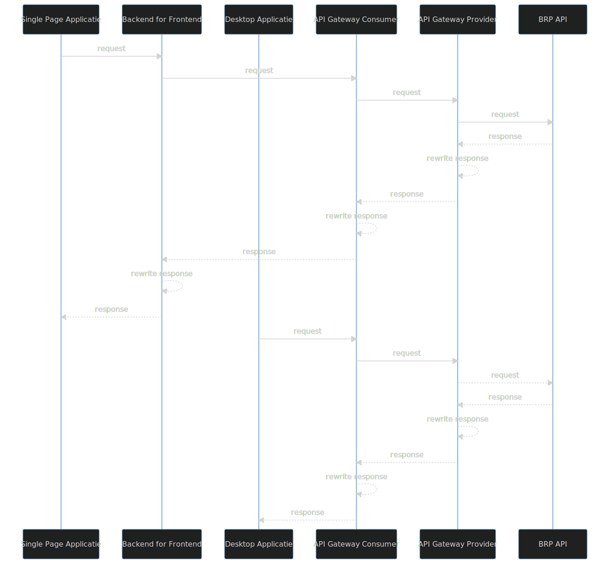
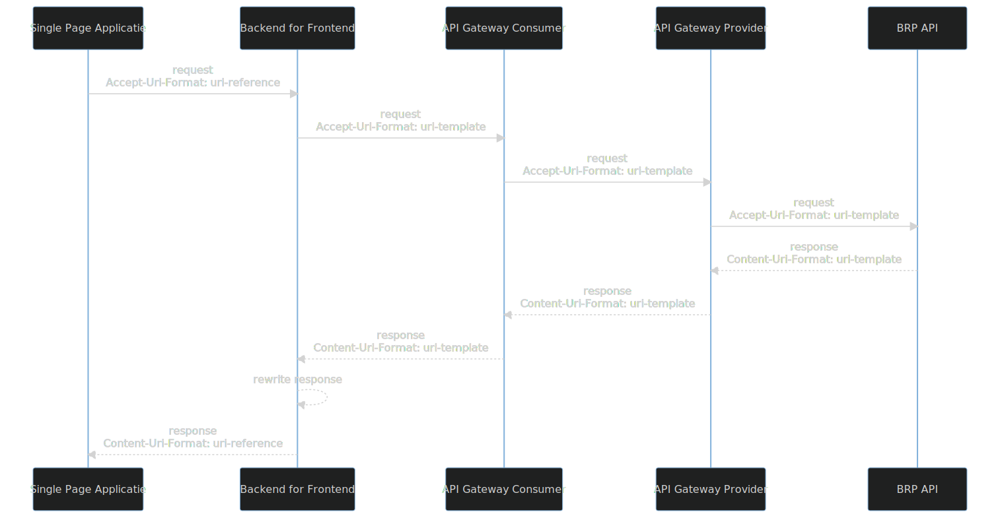
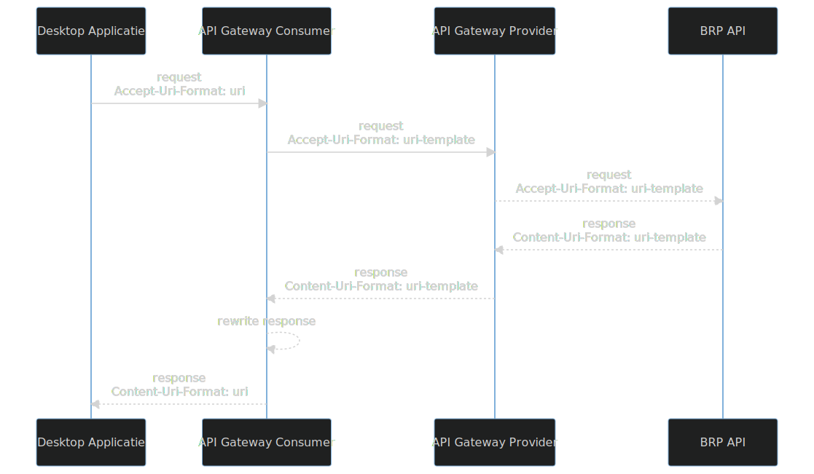

# Uri formattering

In Enterprise systemen is het gebruikelijk om urls in relatieve en absolute formaat te werken.

Absolute urls zijn handig voor applicaties die rechtstreeks verbinding kunnen maken met Web APIs. Voorbeelden van zulke applicaties zijn desktop applicaties, web applicaties die deels of geheel op de server draaien en batch applicaties. Het belangrijkste voordeel van absolute urls is dat ze zonder transformatie kunnen worden gebruikt.

Moderne web applicaties die volledig in een browser draaien (ook bekend als Single Page Applications) kunnen standaard geen absolute urls gebruiken. Om security redenen implementeren alle browsers de [Same-origin Policy](https://developer.mozilla.org/en-US/docs/Web/Security/Same-origin_policy) waardoor code die wordt gedraaid in een browser geen aanroepen kan sturen naar resources van een ander [origin](https://developer.mozilla.org/en-US/docs/Web/Security/Same-origin_policy#definition_of_an_origin).
Om het voor een moderne web applicatie mogelijk te maken aanroepen te sturen naar Web APIs van een ander origin, is het een best practice om de Backend for Frontend (BFF) pattern te implementeren. De Backend is een applicatie die op de server draait om de aanroepen van de Frontend te routeren naar Web APIs.

Web APIs die de HATEOAS constraint implementeren, leveren in hun responses ook urls om de volgende mogelijke aanroepen naar hun consumers te communiceren. Deze aanroepen zijn meestal aanroepen naar resources die de Web API zelf beheert en kunnen daarom relatieve urls zijn. Een belangrijk voordeel van het gebruik van relatieve urls door een Web API is schaalbaarheid. Meerdere instanties van zo'n Web API kan worden opgestart zonder voor elke instantie url configuratie aanpassingen te hoeven maken. Dit vergemakkelijkt ook het deployen van de Web API naar verschillende omgevingen (Test, Acceptatie, Productie). Dit is echter niet mogelijk als de response van een Web API ook urls kan bevatten naar resources van externe Web APIs.

Binnen Enterprise systemen is het gebruikelijk om API Gateways te gebruiken om als centrale ingangspunt te fungeren voor alle clients. Hiermee kan bijv. het verrijken van een aanroep met een access token voor een extene Web API centraal worden geregeld in plaats van bij alle clients. Om ervoor te zorgen dat aanroepen via de centrale ingangspunt gebeuren is het nodig om urls in responses van een Web API aan te passen. Dit kan complex worden als in een response urls in verschillende stijlen voorkomen. Voorbeelden van url stijlen die door de verschillende Haal Centraal APIs worden gebruikt:

- https://api.bag.kadaster.nl/esd/huidigebevragingen/v1
- https://api.brk.kadaster.nl/esd-eto-apikey/bevragen/v1/
- https://api.kadaster.nl/lvwoz-eto/huidigebevragingen

Wanneer er BFFs in het systeem voorkomen is het zelfs nodig om de urls meerdere keren te herschrijven.

Onderstaand figuur 1 visualiseert voor een Single Page Applicatie en een Desktop Applicatie de weg die een request naar en een response van de BRP API maakt. Bij elke tussenstap moeten de urls worden aangepast.

De Haal Centraal APIs maken gebruik van [URI Template](https://datatracker.ietf.org/doc/html/rfc6570) om urls te parameteriseren. Hiermee kunnen gelijksoortige urls (urls die alleen verschillen door path parameter waarde) worden gerepresenteerd met één URI template.

Een URI template bevat één of meerdere expressions waarmee een verzameling van gelijksoortige URIs kan worden beschreven. Een expression is de tekst tussen een open accolade '{' en een sluit accolade '}' inclusief de accolade tekens. Er zijn meerdere expression types met bijbehorende expansie methode. Zie [Expressions](https://datatracker.ietf.org/doc/html/rfc6570#section-2.2).
De Haal Centraal APIs gebruiken 'no operator expressions' zodat consumers 'Simple String Expansion'
kunnen toepassen. Dit houdt in dat een {expression} zonder toepassing van logica kan worden vervangen met een waarde.
Binnen de Haal Centraal APIs worden property namen gebruikt voor expressions. Een property naam is:
- de naam van een property van een resource, v.b. burgerservicenummer of
- de naam van een property van een gegevensgroep van een resource v.b. kinderen.burgerservicenummer

Om de logica voor het aanpassen van Haal Centraal urls door Backend for Frontends en API Gateways zo simpel mogelijk te houden, en om de Haal Centraal API clients de mogelijkheid te bieden om hun gewenste uri formaat aan te kunnen geven, kunnen de Haal Centraal APIs gebruik maken van

- [server-driven negotiation](https://developer.mozilla.org/en-US/docs/Web/HTTP/Content_negotiation)
- uri formats voor [Resource Identifiers](https://json-schema.org/draft/2020-12/json-schema-validation.html#rfc.section.7.3.5)
- [uri-template](https://json-schema.org/draft/2020-12/json-schema-validation.html#rfc.section.7.3.6) 

om de urls in een response te formatteren.

Door middel van een custom HTTP header 'Accept-Uri-Format' kan een Haal Centraal API consumer in een request aangeven in welke format hij de urls in de response wil ontvangen.

De volgende uri formats worden ondersteund:
- uri. Alle links in de response worden geformatteerd als absolute urls.
- uri-reference. 'Same API' links worden geformatteerd als relatieve urls en 'externe API' links als absolute urls.
- uri-template. De server deel van urls wordt gerepresenteerd door een URI Template [Expression](https://datatracker.ietf.org/doc/html/rfc6570#section-2.2).
  Als convententie wordt gehanteerd dat de url van het Server object in de OpenApi specificatie van een Haal Centraal API wordt gerepresenteerd door één van de de volgende server url expressions:
  - {brpserverurl}
  - {brphistorieserverurl}
  - {brpbewoningserverurl}
  - {bagserverurl}
  - {brkserverurl}
  - {wozserverurl} 

De Haal Centraal APIs gebruiken de custom 'Content-Uri-Format' HTTP header om aan te geven welke uri format is gebruikt om de urls in de response te formatteren.    

Onderstaand figuren zijn een uitsplitsing en uitbreiding op figuur 1 waarmee clients, de BFF en API Gateways middels de Accept-URI-Format hun gewenste url formaat aangeven. Door het gebruiken van de uri-template formaat door de BFFs en de API Gateway hoeft het aanpassen van urls in een response slechts één keer te gebeuren.

