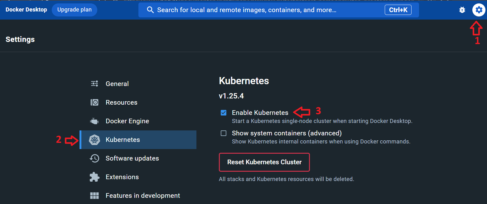

# Getting Started

Gemeenten en andere organisaties met een autorisatiebesluit kunnen zich aanmelden voor deelname aan het Experiment dataminimalisatie.

1. Bekijk de [functionaliteit en specificaties](#functionaliteit-en-specificaties)
2. Probeer en test de {{ site.apiname }} [lokaal](#probeer-en-test-de-api-lokaal) of in de [proef omgeving](#probeer-en-test-de-api-in-de-proef-omgeving)
3. [Download]({{ site.onboardingUrl }}){:target="_blank" rel="noopener"} en lees het onboardingproces

## Functionaliteit en specificaties

De {{ site.apiname }} is gespecificeerd met behulp van de [OpenAPI Specification v3.0.3](https://spec.openapis.org/oas/v3.0.3).

De OAS3 specificatie van de {{ site.apiname }} kan worden bekeken met behulp van [Redoc](./redoc).

Download de [OAS3 specificatie]({{ site.mainBranchUrl }}/specificatie/genereervariant/openapi.yaml){:target="_blank" rel="noopener"} van de '{{ site.apiname }}' om hiermee consumer code te genereren.

De [functionele documentatie](./features-overzicht) van de {{ site.apiname }} vind je in het [features overzicht](./features-overzicht).

## Probeer en test de API in de proefomgeving

Je kunt de {{ site.apiname }} uitproberen op de proefomgeving met de volgende url: [{{ site.proefProxyUrl }}]. Hiervoor heb je een apikey nodig.

- Vraag een apikey aan bij de product owner [{{ site.PO-email }}](mailto:{{ site.PO-email }}). 
- Voeg de apikey toe aan een request met de __X-API-KEY__ header.

## Probeer en test de API lokaal

Een mock van de {{ site.apiname }} is beschikbaar als een containerized applicatie, die je gemakkelijk kunt hosten op een lokale machine of in een testomgeving. Bijkomend voordeel is dat je je eigen testgevallen kunt toevoegen aan het JSON bestand.

Je kunt het [docker compose bestand]({{ site.mainBranchUrl }}/docker-compose-mock.yml){:target="_blank" rel="noopener"} gebruiken om de {{ site.apiname }} mock met behulp van [Docker Desktop](https://www.docker.com/products/docker-desktop) te draaien op een lokale machine.

In plaats van het docker compose bestand kun je de [Kubernetes configuratie bestanden]({{ site.devBranchUrl}}/.k8s){:target="_blank" rel="noopener"} gebruiken om de {{ site.apiname }} mock te draaien op een lokale machine. De {{ site.apiname }} mock maakt gebruik van de [testdataset persoonslijsten proefomgevingen GBA-V](https://www.rvig.nl/media/288) als input om de productie situatie zoveel mogelijk te kunnen simuleren.

De volgende paragrafen beschrijven wat je moet doen om de {{ site.apiname }} mock op een lokale machine te installeren en aan te roepen.

### Prerequisites

- [Docker Desktop](https://www.docker.com/products/docker-desktop) voor het hosten van containers
- Je kunt Docker Desktop ook gebruiken om de containers te hosten met behulp van de Kubernetes engine. Hiervoor moet je in Docker Desktop Kubernetes ondersteuning aanzetten in het Settings/Kubernetes configuratie scherm 

Optioneel kun je de volgende tools ook op de lokale machine installeren:

- [git](https://git-scm.com/downloads) voor het clonen van git repositories
- [Postman](https://www.postman.com/downloads/) voor het aanroepen van {{ site.apiname }}


### Gebruik Docker als container engine

- Download het [docker compose bestand]({{ site.mainBranchUrl }}/docker-compose.yml){:target="_blank" rel="noopener"}
- Start een command prompt window voor de map met het docker-compose.yaml bestand
- Start de {{ site.apiname }} en de mock met behulp van de volgende statement:
  ```sh

  docker-compose -f docker-compose-mock.yml up -d

  ```
  De {{ site.apiname }} mock is nu te benaderen via de url: *http://localhost:5001/haalcentraal/api/brp/personen*
- Valideer dat de {{ site.apiname }} mock draait met behulp van de volgende curl statement:
  ```sh

  curl --location --request POST 'http://localhost:5001/haalcentraal/api/brp/personen' \
  --header 'Content-Type: application/json' \
  --data-raw '{
      "type": "RaadpleegMetBurgerservicenummer",
      "burgerservicenummer": ["999993653"],
      "fields": ["burgerservicenummer"]
  }'

  ```
- Om de {{ site.apiname }} mock container te stoppen voer je de volgende statement uit:
  ```sh

  docker-compose -f docker-compose-mock.yml down

  ```

### Gebruik Kubernetes als container engine

- Download de [kubernetes configuratie bestanden]({{ site.devBranchUrl }}/.k8s){:target="_blank" rel="noopener"}
- Start een command prompt window voor de map met de kubernetes manifest bestanden
- Start de {{ site.apiname }} en de mock met behulp van de volgende statement:
  ```sh

  kubectl apply -f .k8s/brppersonenmock-deployment.yaml \
                -f .k8s/brppersonenmock-service.yaml 

  ```
  De {{ site.apiname }} mock is nu te benaderen via de url: *http://localhost:5001/haalcentraal/api/brp/personen*
- Valideer dat de {{ site.apiname }} mock draait met behulp van de volgende curl statement:
  ```sh

  curl --location --request POST 'http://localhost:5001/haalcentraal/api/brp/personen' \
  --header 'Content-Type: application/json' \
  --data-raw '{
      "type": "RaadpleegMetBurgerservicenummer",
      "burgerservicenummer": ["999993653"],
      "fields": ["burgerservicenummer"]
  }'

  ```
- Om de {{ site.apiname }} mock container te stoppen voer je de volgende statement uit:
  ```sh

  kubectl delete -f .k8s/brppersonenmock-deployment.yaml \
                 -f .k8s/brppersonenmock-service.yaml 

  ```
